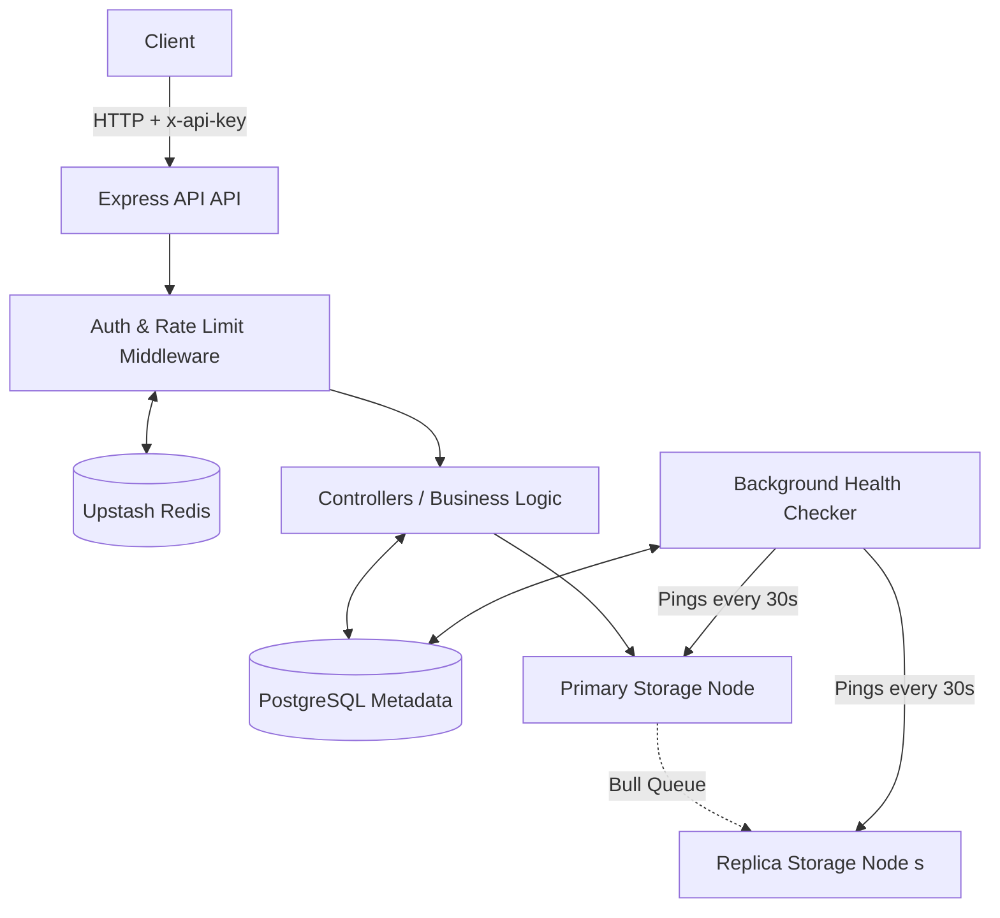

# VaultFS 🗄️

VaultFS is a lightweight, distributed file storage system built from scratch in Node.js. Designed as an educational, self-hosted clone of the core concepts behind Amazon S3, VaultFS implements advanced storage features including **chunked storage**, **content-addressed deduplication**, **multi-node replication**, and **automatic failover**.

Instead of merely saving files to a local disk, VaultFS addresses complex storage engineering challenges:
- Handling duplicate uploads without wasting disk space.
- Surviving storage node failures during reads and writes.
- Providing secure, time-limited download access without permanent authentication.
- Versioning files to keep historical data intact without duplicating unchanged chunks.

---

## 🏗 System Architecture

VaultFS follows a distributed architecture with a single API entry point, a relational metadata store, and multiple physical (or logical) storage nodes connected via a background job queue for eventual consistency.



### Request Flow: Uploading a File
1. **Authentication & Rate Limiting**: Requests to `POST /api/buckets/:bucketId/files` are intercepted by the `requireApiKey` middleware, which validates the API key and checks rate limits (100 req/60s via Upstash Redis).
2. **Chunking**: The uploaded file (received in memory via Multer) is split into 1 MB chunks.
3. **Deduplication**: Each chunk is hashed (SHA-256). If the hash already exists in PostgreSQL, VaultFS simply points the new file's record to the existing chunk, avoiding redundant disk I/O.
4. **Primary Write & Async Replication**: New chunks are synchronously written to a **primary** storage node. A replication job is then pushed to a Redis-backed Bull queue to asynchronously copy the chunk to **replica** nodes.
5. **Versioning**: Uploading a file with an existing name increments its `version`, preserving previous iterations.

### Request Flow: Downloading a File
1. VaultFS retrieves the ordered list of chunks from PostgreSQL.
2. For each chunk, it checks active nodes containing a replica and attempts to read it.
3. If a node fails (e.g., node down or file missing), the node is marked as inactive, and the next replica is tried transparently.
4. Chunks are streamed and concatenated in memory, returning the complete file with the original `Content-Type`.

### Failure Detection
A background service (`healthcheck.service.js`) runs every 30 seconds, writing, reading, and deleting a probe file on every registered node. It updates the `is_active` status in PostgreSQL, ensuring the API only routes traffic to healthy nodes.

---

## 🛠 Tech Stack

| Component | Technology |
|---|---|
| **Runtime** | Node.js (ES Modules) |
| **API Framework** | Express.js 5 |
| **Metadata Store** | PostgreSQL |
| **Message Queue** | Bull (Redis-backed) |
| **Rate Limiting / Tokens** | Upstash Redis (REST) |
| **File Processing** | Multer |
| **Infrastructure** | Docker + Docker Compose |
| **CI/CD** | GitHub Actions |

---

## 🚀 Getting Started

### Prerequisites
- Docker & Docker Compose (Recommended)
- Node.js 18+ (For manual setup)
- PostgreSQL (For manual setup)

### Option A: Docker Compose (Recommended)
This spins up the API and PostgreSQL container together. The database schema is applied automatically.

```bash
git clone https://github.com/Deepanshu4m/VaultFS.git
cd VaultFS

# Create environment file
cp .env.example .env

# Start the stack
docker compose up --build
```
The API will be available at `http://localhost:3000`.

### Option B: Local Setup (Without Docker)

```bash
git clone https://github.com/Deepanshu4m/VaultFS.git
cd VaultFS

npm install
```

Apply the database schema to your running PostgreSQL instance:
```bash
psql -U <your_user> -d <your_db> -f src/config/schema.sql
```

Create your `.env` file (see Environment Variables section) and start the server:
```bash
npm run dev
```

---

## ⚙️ Environment Variables

Create a `.env` file in the root directory:

```ini
PORT=3000

# PostgreSQL Configuration
DB_HOST=localhost
DB_PORT=5432
DB_NAME=vaultfs
DB_USER=postgres
DB_PASSWORD=yourpassword

# Redis Configuration (For Bull Queue)
REDIS_URL=redis://localhost:6379

# Upstash Redis REST (For Rate Limiting & Signed URLs)
UPSTASH_REDIS_REST_URL=https://...
UPSTASH_REDIS_REST_TOKEN=your_token
```

---

## 📡 API Reference

### 1. Authentication
Generate an API key to access protected routes.
```bash
curl -X POST http://localhost:3000/api/auth/generate-key \
  -H "Content-Type: application/json" \
  -d '{"name": "dev-key"}'
```

*(Note: Use the generated key in the `x-api-key` header for subsequent requests.)*

### 2. Node Management
Register storage nodes (directories on your filesystem) before uploading. You need at least two nodes for replication to work.

```bash
mkdir -p storage/node1 storage/node2

curl -X POST http://localhost:3000/api/nodes \
  -H "x-api-key: <your_api_key>" \
  -H "Content-Type: application/json" \
  -d '{"path": "./storage/node1"}'
```

### 3. File Operations
Upload a file to a bucket:
```bash
curl -X POST http://localhost:3000/api/buckets/1/files \
  -H "x-api-key: <your_api_key>" \
  -F "file=@/path/to/your/file.txt"
```

Download a file (returns latest version):
```bash
curl -X GET "http://localhost:3000/api/buckets/1/files/file.txt/version" \
  -H "x-api-key: <your_api_key>"
```

### 4. Signed URLs
Generate a time-limited, public download link for a file (bypasses `x-api-key`).

```bash
curl -X POST http://localhost:3000/api/buckets/1/files/<file_id>/signed-url \
  -H "x-api-key: <your_api_key>"
```

### 5. API Endpoints Summary

| Method | Endpoint | Description | Auth Required |
|---|---|---|---|
| `GET` | `/health` | Liveness check | ❌ |
| `POST` | `/api/auth/generate-key` | Issue a new API key | ❌ |
| `POST` | `/api/buckets` | Create a new bucket | ✅ |
| `GET` | `/api/buckets` | List all buckets | ✅ |
| `POST` | `/api/buckets/:bucketId/files` | Upload a file | ✅ |
| `GET` | `/api/buckets/:bucketId/files/:filename/version` | Download file by name (supports `?version=N`) | ✅ |
| `POST` | `/api/buckets/:bucketId/files/:fileId/signed-url` | Generate public download link | ✅ |
| `GET` | `/api/buckets/public/download/:token` | Download via signed token | ❌ |
| `POST` | `/api/nodes` | Register a new storage node | ✅ |
| `GET` | `/api/stats` | Retrieve system stats & chunk distribution | ✅ |

---

## 🗄️ Database Schema

VaultFS uses PostgreSQL with six core tables:
- **`buckets`**: Namespaces for files.
- **`files`**: File metadata and versioning (`size`, `mime_type`, `version`).
- **`chunks`**: 1 MB segments of files, indexed by SHA-256 hash for deduplication.
- **`nodes`**: Registered storage locations and active status.
- **`chunk_nodes`**: Join table mapping chunks to physical nodes (enabling failover/replication).
- **`api_keys`**: API key management and validation.

---

## ⚠️ Known Limitations

- **No Load Balancing:** Primary and replica nodes are currently selected based on database order rather than capacity or latency.
- **Plaintext API Keys:** API keys are stored in plaintext. This should be updated to use hashed storage for production environments.
- **No Queue Retries:** If an asynchronous replica write fails via Bull, it fails silently without automatic retries.

---

## 🤝 Contributing
Contributions are welcome! Feel free to open an issue or submit a Pull Request if you'd like to improve the load balancing, add queue retries, or enhance security.
